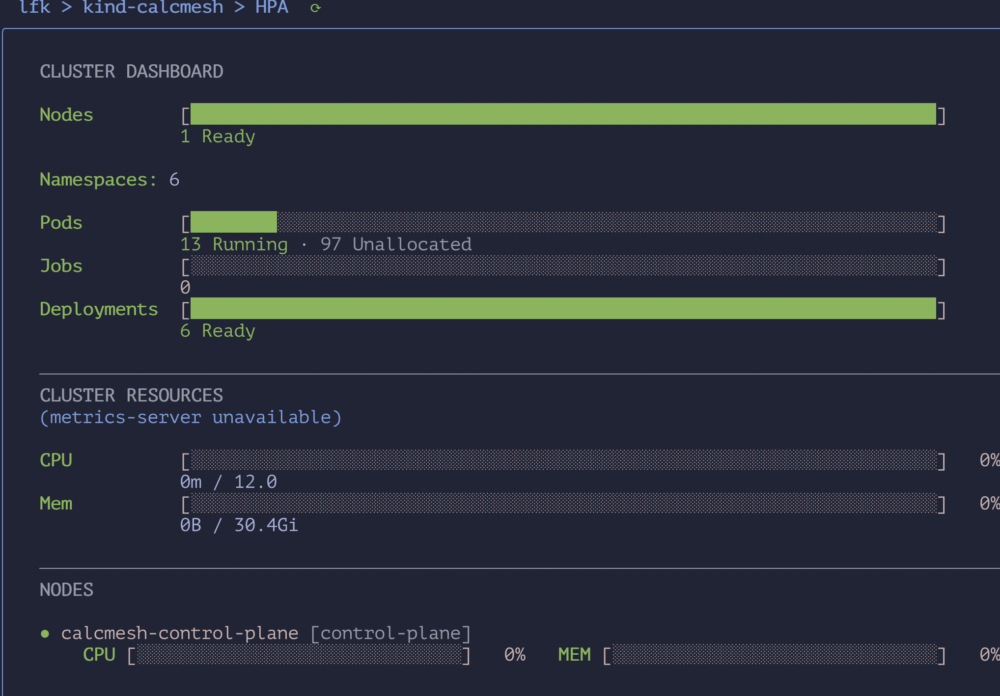

# Building a Calculator Mesh on Kubernetes

*Part 1: The Cluster and the Control Plane*

*Also on [Substack](https://amineh.substack.com/p/building-a-calculator-mesh-on-kubernetes).*

## 1. The project and why

I am setting out to build the simplest possible service mesh. A lot of big enterprise applications are, in some way, a service mesh. My definition of a service mesh is a collection of services that run in isolation, but can still talk to each other, either directly or through a coordinator. The only purpose of this project is learning. More specifically I’d like to learn the dynamics of a running service mesh and I wanna learn what frameworks and technologies are the most natural to implement this with.

In this project services are as simple as possible. One calculator service per each operator, addition, subtraction, multiplication and division. A client calls one main endpoint, and the proxy routes the request to the right calculator service based on the request body.

Given these technical requirement, I only need two main decision to get started. The first decision is how to deploy, watch and recover all my services containers. For this Kubernetes seems like a natural choice as for container orchestrator. Second decision is on network routing. Since I am trying to learn about [Envoy](https://github.com/envoyproxy/envoy), I use Envoy as L7 Proxy to do the request routing based on body of request.

This first tutorial is about bootstrapping the Kubernetes cluster, with only the Kubernetes concepts we need for that.

All the code for this series is on GitHub: [github.com/aminehd/calcmesh](https://github.com/aminehd/calcmesh). I’ll really appreciate if you follow me or give my repos a star ;)

## 2. Kubernetes concepts I need

To cut to the point, I first explain my very narrow view-point of Kubernetes. The only thing I care about at this point is to have one git repository associated with my whole service mesh and then be sure that once I merged my code to the repo, my service mesh gonna be running as I desire. This is something that almost all enterprise are doing because once you set it up, all your team need to do is to maintain the code, and if the code is good the service will be running.

The idea is kinda like the manifestation journals. You pick a nice journal (a git repo) write your desires in a certain way (Kubernetes manifest files), hope for best ( `kubectl apply` ), and then something fulfill them (Kubernetes control-plane). If you watch anime, it is kinda like Death Notes.

After initial setup you have a Kubernetes cluster. This cluster has two parts:

The first part is the control plane. One thing that helped me understand Kubernetes is that the control plane is not our code; it is Kubernetes’ own code. No matter what your service code is, Kubernetes control-plane is going to do the same thing. It has three building blocks:

- **Controllers** run the loops that reconcile the desired state with the current state.
- **The scheduler** assigns Pods to real nodes.
- **The API server** stores our objects. It is the only door into the cluster: developers, controllers, the scheduler and the nodes all talk to it.

The second part is the worker nodes, where our containers and pods will run.

This control-plane pattern shows up in many other infrastructure systems too.

If you want to see these ideas explained visually, watch this playlist: [Kubernetes on YouTube](https://www.youtube.com/playlist?list=PLy7NrYWoggjwPggqtFsI_zMAwvG0SqYCb)

## 3. How I use them here

This is the folder structure:

```
calcmesh/
├── bootstrap/
│   └── kind-cluster.yaml        # the cluster: one node
├── calculators/                 # one folder per calculator (placeholders for now)
│   ├── addition/
│   ├── subtraction/
│   ├── multiplication/
│   └── division/
├── envoy/                       # the proxy config goes here (placeholder for now)
├── operator/                    # my own operator and its Helm chart (next parts)
├── tutorials/
│   └── part1.md
└── README.md
```

To run Kubernetes on my PC, I use kind, which stands for Kubernetes IN Docker. Real clusters run on many machines; kind fakes them. Every node is a Docker container, and inside it runs the real Kubernetes: the same API server, etcd, scheduler and controllers as a cloud cluster. So one PC can have one node or five, and if you break it, you delete it and make a new one in a minute.

In this tutorial there is only one file, kind-cluster.yaml, and it creates a cluster with one node. Notice that this file is not a Kubernetes manifest. It is kind’s own config (look at the apiVersion). It never goes to the API server; kind only reads it to know how many nodes to make. Then I create the cluster with kind:

```yaml
# One node: it runs the control plane (API server, etcd, scheduler,
# controller manager) and your pods.
kind: Cluster
apiVersion: kind.x-k8s.io/v1alpha4
nodes:
  - role: control-plane
```

```bash
kind create cluster --name calcmesh --config bootstrap/kind-cluster.yaml
kubectl get nodes
```



For the services and for Envoy, there are only placeholders for now. The main point for me is to keep the services isolated from the networking code, which lives in Envoy.

## 4. Conclusion and what’s next

To run it yourself, you only need Docker, kind and kubectl. Clone the repo and bring up the cluster:

```bash
git clone https://github.com/aminehd/calcmesh.git
cd calcmesh
kind create cluster --name calcmesh --config bootstrap/kind-cluster.yaml
```

Then look at the control plane. It runs as pods inside our one node:

```bash
kubectl get pods -n kube-system
```

You should see kube-apiserver, etcd, kube-scheduler and kube-controller-manager, the same pieces from section 2. When you are done, `kind delete cluster --name calcmesh` removes everything.

What I take away from this part:

1. This project builds a service mesh of calculators that talk to each other. Kubernetes runs the containers, and Envoy will be the network proxy.
2. A Kubernetes cluster has a control plane. The control plane always watches the objects we sent to the API server, and keeps the running state matched to our desired state.
3. kind runs a real Kubernetes cluster on one PC, where every node is a Docker container.
4. We saw the structure of the code.

In the next part, I use Helm to put the calculators in the cluster. Helm is a package manager for Kubernetes. Instead of writing one Deployment and one Service for each calculator by hand, I write one template with a loop and a values.yaml with the list of calculators. Helm generates all the YAML and sends it to the API server. Adding a new calculator becomes one line, and if something breaks, Helm can roll back to the last version.

If you liked this, follow me on [Threads](https://www.threads.com/@aminehdadsetan) for the next parts, and give the project a star on [GitHub](https://github.com/aminehd/calcmesh) so you get notified when the next part lands.
